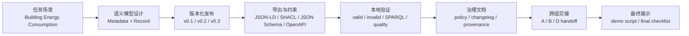

# DSSC C 组项目总体介绍

本文用于后续研讨和展示前的总体梳理，重点说明本项目在 DSSC Toolbox 研究任务中的定位、仓库各板块的作用，以及 C 组从任务要求到可复现交付物的实现流程。这里暂不展开具体字段、脚本实现和每个验证报告的细节，后续可以按本文结构继续细化讲解。

## 1. 项目定位

本项目是 DSSC Toolbox 研究任务中 C 组的交付包，主题是 **Semantic Treehouse / Semantic Model Governance**。C 组负责的是 data space 工具链中的共同语义模型层，也就是定义、维护、版本化和验证数据产品所依赖的语义契约。

与其他小组相比，C 组不直接实现 connector、trust service 或完整的 conformance test bed，而是为这些环节提供可复用的语义基础：

- 给 A 组提供 data offering metadata 可使用的字段和模型约束。
- 给 D 组提供 SHACL shapes、valid/invalid 样例和验证报告。
- 给 B 组提供模型版本、URI、provenance 等可用于合规或凭证说明的参考信息。
- 给最终集成故事提供 “semantic model -> data offering -> compliance -> validation” 这一条主线中的语义治理部分。

项目最终形成的是一个可复现的语义治理包：即使 Semantic Treehouse 本身不可用，也可以通过本地脚本、Docker、报告文件和 CI 入口独立验证模型产物。

## 2. 统一业务场景

任务使用的统一场景是 **Building Energy Consumption Data Product**。场景设定为：能源数据提供方 `Energy Data Provider Ltd.` 在 data space 中发布建筑小时级用电量数据，消费者 `City Analytics Lab` 发现并申请访问，data space authority 要求数据产品具备共同语义模型、基础合规描述，并可以通过 metadata validation。

核心数据产品信息包括：

| 项目 | 内容 |
|---|---|
| Data Product | Building Energy Consumption Dataset API |
| Dataset ID | `building-energy-hourly-v1` |
| Format | JSON |
| Frequency | hourly |
| Unit | kWh |
| Endpoint | `https://api.example.org/energy/buildings/hourly` |
| Spatial Coverage | Shenzhen demo district |
| Temporal Coverage | 2026-05-01 to 2026-05-02 |

这个场景足够小，便于做最小 demo；同时又能覆盖 data product metadata、API record payload、SHACL validation、OpenAPI schema、跨组交接等关键研究点。

## 3. 仓库结构总览

仓库可以从三个层面理解：

| 板块 | 主要路径 | 作用 |
|---|---|---|
| 任务与场景输入 | `task_plan/` | 保存课程任务说明、统一场景包、task1/task2 阶段性任务材料。 |
| C 组核心交付 | `C_Semantic_Treehouse/` | 语义模型、验证脚本、治理文档、报告、证据和交接材料的主体目录。 |
| 复现与工程入口 | `Makefile`、`make.cmd`、`Dockerfile.validation`、`docker-compose.validation.yml`、`.github/workflows/` | 提供本地和 CI 验证入口，支撑可复现运行。 |

其中最重要的是 `C_Semantic_Treehouse/`。它内部大致分为以下模块：

| 模块 | 作用 |
|---|---|
| `model/` | 保存 v0.1、v0.2、v0.3 三个版本的 ontology、JSON-LD context、SHACL shapes、JSON Schema、OpenAPI fragment 和样例数据。 |
| `validation/` | 保存 RDF、JSON-LD、SHACL、JSON Schema、OpenAPI、SPARQL、governance、quality 等验证报告。 |
| `scripts/` | 保存本地验证脚本、SPARQL 测试脚本、质量指标脚本和 Semantic Treehouse 部署辅助脚本。 |
| `mappings/` | 保存与 DCAT、DCTERMS、SOSA/SSN、QUDT/UCUM、OWL-Time 等外部标准的 SSSOM 映射表。 |
| `governance/` | 保存 model card、changelog、namespace policy、release policy、deprecation policy、review workflow 和 provenance metadata。 |
| `quality/` | 保存模型质量评估，包括字段覆盖率、约束强度、标准复用比例和版本变更风险。 |
| `diagrams/` | 保存模型关系图和语义治理流程图的 Mermaid 源文件。 |
| `handoff/` | 保存面向 A、B、D 组的交接说明。 |
| `evidence/` | 保存 Semantic Treehouse 本地部署与 smoke check 证据。 |
| `docs/` | 保存展示、最终检查清单和 AI-assisted human-governed modeling 等说明文档。 |

## 4. 核心成果板块

### 4.1 语义模型板块

项目围绕两个层次建立语义模型：

- **Data Product Metadata**：描述数据产品本身，用于 catalogue、connector offering 和 SHACL validation。
- **Energy Reading Record**：描述 API 返回的一条能耗读数，用于 mock API、JSON Schema 和 OpenAPI response schema。

模型采用版本化设计：

- `v0.1`：建立最基础的数据产品 metadata 字段。
- `v0.2`：增加 endpoint、unit、temporal coverage，并强化部分取值约束。
- `v0.3`：在 metadata 模型之上扩展 API record payload schema。

这样设计的好处是展示了语义模型如何从最小可用版本逐步演进，同时能够说明每次变更对 A 组 data offering 和 D 组 validation 的影响。

### 4.2 验证与复现板块

项目不仅保存模型文件，还建立了独立的本地验证链路。主要验证类型包括：

- RDF/Turtle 解析检查。
- JSON-LD 解析和 expansion 检查。
- SHACL valid/invalid case 验证。
- JSON Schema record validation。
- OpenAPI fragment 检查。
- SPARQL competency questions。
- Governance 文档与 provenance 检查。
- 必需文件和链接路径检查。

这些检查可以通过根目录命令统一运行：

```bat
cmd /c make validate
```

也可以单独运行某一类检查，例如 `validate-shacl`、`validate-jsonschema`、`test-sparql`、`quality` 等。

### 4.3 标准映射与质量板块

项目没有把所有概念都自定义为本地术语，而是通过 SSSOM 表和模型设计文档说明与外部标准的对应关系。涉及的标准包括 DCAT/DCAT-AP、DCTERMS、SOSA/SSN、QUDT/UCUM、OWL-Time 等。

质量评估板块主要回答三个问题：

- 任务要求的字段是否都被模型覆盖。
- 模型约束是否足够支撑 valid/invalid case。
- 本地术语与外部标准之间的复用和映射程度如何。

### 4.4 治理与版本管理板块

语义模型不是一次性文件，而是需要治理的资产。因此项目补充了 model card、changelog、namespace policy、release policy、deprecation policy、review workflow 和 provenance metadata。

这一板块的讲解重点是：C 组不只是“写了几个模型文件”，而是把语义模型当作 data space 中可维护、可审查、可发布、可追溯的共同契约来处理。

### 4.5 Semantic Treehouse 证据板块

项目包含 Semantic Treehouse 本地部署辅助脚本和证据文件。当前交付中，Semantic Treehouse 被作为支持性证据轨道：本地 UI smoke check 有记录，但项目的核心可复现路径仍然是独立本地验证脚本。

这种处理方式降低了展示风险：即使现场不启动 Treehouse UI，也可以通过模型文件、验证脚本和报告说明 C 组成果的完整性。

### 4.6 跨组交接板块

项目提供了面向其他小组的 handoff 文档：

- A 组可以复用 metadata 字段和版本化模型 URI 来发布 data offering。
- D 组可以使用 SHACL shapes、valid/invalid examples 和验证命令来设计 validation demo。
- B 组可以参考模型 URI、provenance 和 governance metadata，用于合规流程中的说明或凭证上下文。

跨组交接是最终集成故事的关键，因为它说明 C 组成果如何被其他工具链环节消费。

## 5. 实现流程概览

从仓库中的 phase summary 和交付物来看，项目实现过程可以概括为以下阶段：

| 阶段 | 主要工作 | 产出重点 |
|---|---|---|
| Phase 0 | 仓库审计和项目脚手架 | 建立目录结构、README、基础 Makefile、初始验证入口。 |
| Phase 1 | 核心模型构建 | 建立 v0.1/v0.2/v0.3 模型、JSON-LD、SHACL、JSON Schema、OpenAPI 和样例。 |
| Phase 2 | 验证工具链 | 增加 RDF、JSON-LD、SHACL、JSON Schema、OpenAPI 验证脚本和 Docker 复现方式。 |
| Phase 3 | SPARQL 能力问题 | 用 competency questions 检查模型是否能回答关键治理问题。 |
| Phase 4 | 标准映射和质量指标 | 增加 SSSOM 映射表、字段覆盖率、复用比例和变更风险评估。 |
| Phase 5 | 治理文档和 provenance | 补充 model card、版本策略、命名空间策略、发布策略、审查流程和 provenance。 |
| Phase 6 | Semantic Treehouse 证据 | 记录本地部署、上游版本、容器状态和 smoke check 结果。 |
| Phase 7 | 报告、图和交接 | 完成关系图、治理流程图、A/D/B 交接说明和展示材料。 |
| Phase 8 | CI 与最终加固 | 增加 GitHub Actions、必需文件检查、路径链接检查和最终 checklist。 |

整体实现逻辑可以概括为：



## 6. 建议的介绍顺序

后续做研讨或课堂介绍时，可以按下面的顺序展开：

1. **先讲任务背景**：DSSC Toolbox 分成 A/B/C/D 四个方向，C 组负责共同语义模型治理。
2. **再讲统一场景**：用建筑能耗数据产品解释 provider、consumer、authority 和 data product metadata。
3. **说明 C 组要解决的问题**：如何定义模型、如何版本化、如何让模型可验证、如何给其他组复用。
4. **展示仓库结构**：重点打开 `C_Semantic_Treehouse/`，说明 `model/`、`validation/`、`governance/`、`handoff/`、`evidence/` 的作用。
5. **讲模型演进**：从 v0.1 到 v0.3，说明为什么逐步增加约束和 record payload。
6. **讲验证流程**：展示 `make validate` 作为复现入口，再解释 valid case 通过、invalid case 按预期失败。
7. **讲治理价值**：说明 changelog、namespace、release policy、provenance 如何让模型成为可维护资产。
8. **讲跨组集成**：用 handoff 文档串起 A 组 data offering、D 组 validation 和 B 组合规说明。
9. **最后讲限制和后续工作**：Semantic Treehouse UI 证据仍是辅助轨道，生产级模型还可以进一步扩展 provider、location、unit 和 OWL-Time 表达。

## 7. 后续可细化的讲解主题

这份总览之后，可以继续拆成几份更细的介绍材料：

- `01_task_and_scenario.md`：详细讲 task_plan 和 Building Energy Consumption 场景。
- `02_semantic_model_design.md`：详细讲两个模型、字段、IRI、JSON-LD 和外部标准映射。
- `03_versioning_and_governance.md`：详细讲 v0.1/v0.2/v0.3、release policy、changelog 和 provenance。
- `04_validation_workflow.md`：详细讲 SHACL、JSON Schema、OpenAPI、SPARQL 和质量指标。
- `05_treehouse_and_reproducibility.md`：详细讲 Semantic Treehouse 证据、本地验证、Docker 和 CI。
- `06_cross_group_handoff.md`：详细讲 C 组如何服务 A/B/D 组和最终集成 demo。

## 8. 关键参考文件

- 任务设计方案：`task_plan/DSSC_Toolbox_Research_Task_Plan.md`
- 统一场景说明：`task_plan/DSSC_Toolbox_Scenario.md`
- C 组主 README：`C_Semantic_Treehouse/README.md`
- 模型设计说明：`C_Semantic_Treehouse/C_semantic_model_design.md`
- 模型版本说明：`C_Semantic_Treehouse/C_model_versioning_demo.md`
- 验证报告汇总：`C_Semantic_Treehouse/validation/all-validations-report.md`
- 最终总结：`C_Semantic_Treehouse/FINAL_SUMMARY.md`
- 五分钟展示脚本：`C_Semantic_Treehouse/docs/demo-script.md`
- 最终检查清单：`C_Semantic_Treehouse/docs/final-checklist.md`
